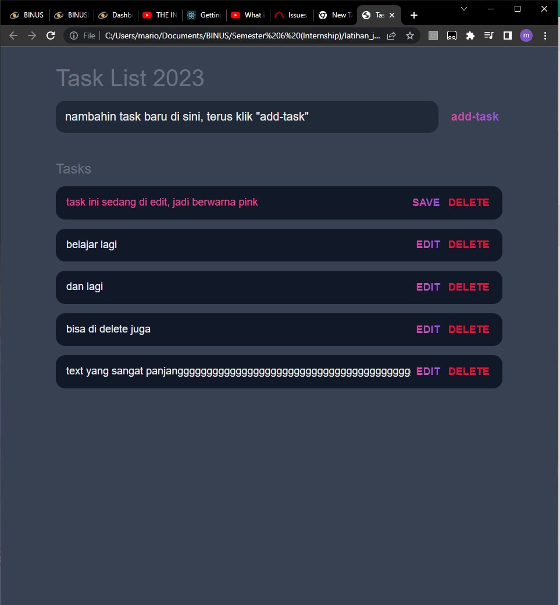

# First Todo List

A basic Todo-List with CRUD concepts.

Project made by Mario (with some of my own code modifications).

---

Some screenshots:

---

The tutorial video can be found [here](https://www.youtube.com/watch?v=MkESyVB4oUw)

